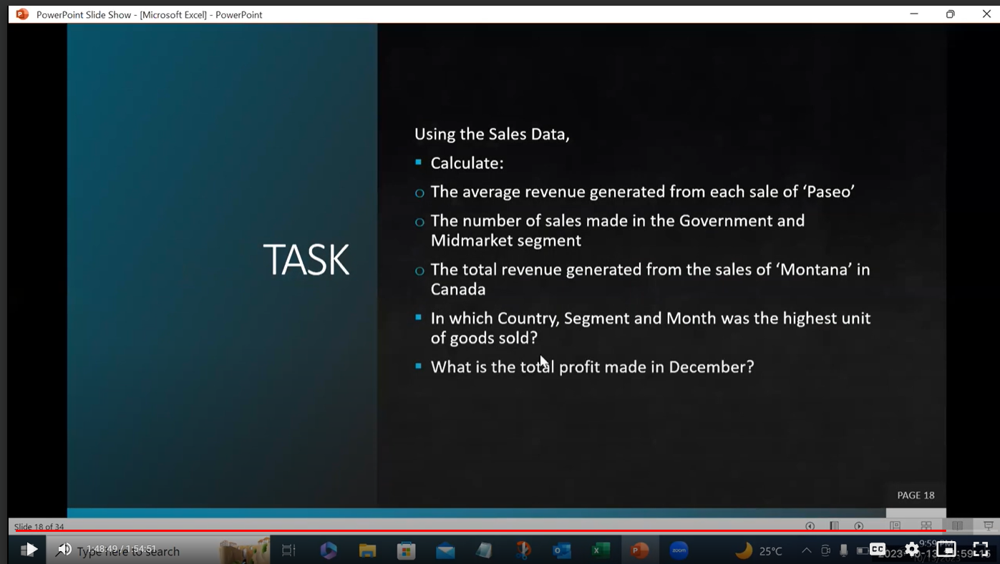
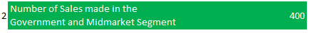
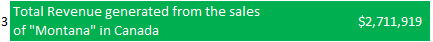
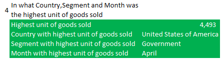

# Financials-Dataset-Analysis

## Introduction
The data analyzed here relates to Sales data for several countries,segments and years. It includes Units sold, Sales values, Discounts and other related data.

## Task 

## Answers
1. I used the "Average if" function to generate the Average Revenue from Sale of the product "Paseo".
   ### "AVERAGEIF('Advanced Functions Task'!K:K,'Task - Advanced Functions'!H3,'Advanced Functions Task'!A:A)"
   
   
2. I used a combined Countif function in one cell to arrive at Number of Sales made in "Government" and "Midmarket" Segments as the two of them are 
   in the same column.
   ### "COUNTIF('Advanced Functions Task'!N:N,H5)+COUNTIF('Advanced Functions Task'!N:N,H4)"
   
   
3.  I used a Sumifs function as i needed to get both the sales in Montana and the sales in Canada.
     ### "SUMIFS('Advanced Functions Task'!A:A,'Advanced Functions Task'!K:K,H6,'Advanced Functions Task'!C:C,H7)"

       
   
5. The highest units of goods sold was 4,493 units in Unites States of America,Government Segment in month of April.
    I used a combination of Max and Xlook up functions to arrive at these.

   
   

   
6. The Total profit made in December was $2.7m
   
   

## CONCLUSION AND RECOMMENDATION
  TEfforts need to be made to increase overall sales of the company.

   
